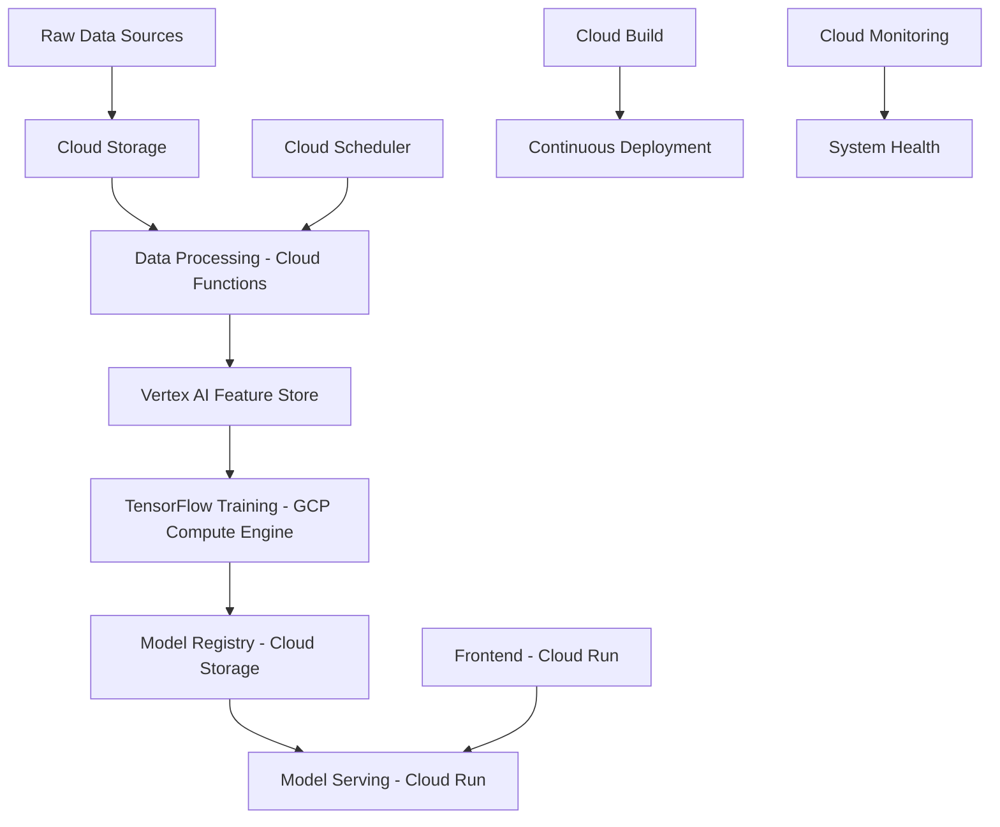

# GenAI-Recommender: Production-Grade Recommendation System

A production-ready recommendation system leveraging Google Cloud Platform (GCP) and MLOps best practices to deliver personalized recommendations at scale.

## System Architecture

The system is built on GCP with the following components:



## Key Components

### Data Pipeline
- **Storage**: Cloud Storage for raw data and model artifacts
- **Processing**: Cloud Functions for data transformation and feature computation
- **Feature Store**: Vertex AI Feature Store for feature management and serving
- **Orchestration**: Cloud Composer (managed Apache Airflow) for pipeline orchestration

### Training Infrastructure
- **Compute**: GCP Compute Engine with GPU support
- **Framework**: TensorFlow with custom training loops
- **Experimentation**: MLflow for experiment tracking
- **Model Storage**: Cloud Storage for model versioning

### Serving Infrastructure
- **Model Serving**: Cloud Run with auto-scaling
- **API Layer**: FastAPI for prediction endpoints
- **Frontend**: Streamlit application on Cloud Run
- **Load Balancing**: Cloud Load Balancing for traffic management

### MLOps & Monitoring
- **CI/CD**: Cloud Build for automated testing and deployment
- **Monitoring**: Cloud Monitoring with custom metrics
- **Logging**: Cloud Logging with structured logs
- **Alerting**: Cloud Monitoring alerts for system health

## Features

- Two-tower neural network architecture for efficient retrieval
- Real-time feature serving through Vertex AI Feature Store
- A/B testing capability through Cloud Run traffic splitting
- Automated retraining pipelines
- Real-time prediction serving
- Model performance monitoring
- Feature drift detection
- Automated model deployment
- Comprehensive logging and tracing

## Development Workflow

1. Feature Engineering
   - Feature definition in Vertex AI Feature Store
   - Automated feature computation pipelines
   - Feature validation and testing

2. Model Development
   - Experiment tracking with MLflow
   - Model versioning in Cloud Storage
   - Automated evaluation pipelines

3. Deployment
   - Automated CI/CD through Cloud Build
   - Gradual rollout with Cloud Run traffic splitting
   - Automated rollback capabilities

4. Monitoring
   - Model performance metrics
   - System health metrics
   - Business metrics tracking

## Getting Started

### Prerequisites

- Google Cloud Platform account
- Enabled APIs:
  - Cloud Run API
  - Cloud Build API
  - Cloud Storage API
  - Vertex AI API
  - Cloud Composer API
  - Cloud Functions API
  - Cloud Monitoring API

### Installation

1. Clone the repository:
```bash
git clone https://github.com/yourusername/genai-recommender.git
cd genai-recommender
```

2. Set up GCP authentication:
```bash
gcloud auth application-default login
```

3. Set up environment variables:
```bash
export PROJECT_ID="your-project-id"
export REGION="your-region"
```

4. Deploy infrastructure:
```bash
terraform init
terraform apply
```

### Configuration

Create a `.env` file with the following variables:
```env
GCP_PROJECT_ID=your-project-id
GCP_REGION=your-region
VERTEX_ENDPOINT=your-endpoint
```

## Project Structure

```
genai-recommender/
├── .github/workflows/    # CI/CD workflows
├── terraform/           # Infrastructure as Code
├── src/
│   ├── features/        # Feature engineering code
│   ├── models/          # Model architecture and training
│   ├── serving/         # Serving infrastructure
│   └── monitoring/      # Monitoring and logging
├── configs/             # Configuration files
├── tests/               # Test suite
└── notebooks/           # Development notebooks
```

## Contributing

Please read [CONTRIBUTING.md](CONTRIBUTING.md) for details on our code of conduct and the process for submitting pull requests.

## License

This project is licensed under the MIT License - see the [LICENSE](LICENSE) file for details.

## Acknowledgments

- Google Cloud Platform documentation
- TensorFlow Recommenders
- MLOps community best practices
