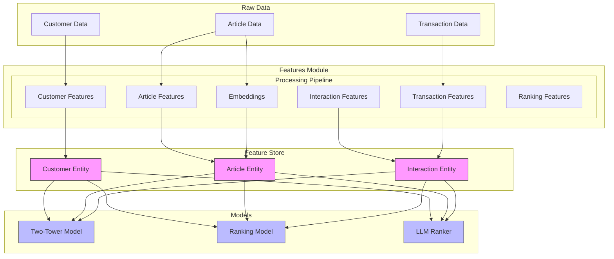

# Feature Engineering Module

This directory contains the feature engineering pipeline for the real-time personalized recommender system. It processes raw data into feature sets that are stored in the Vertex AI Feature Store and used by various models in the system.

## 📊 Overview

The feature engineering module is responsible for:
1. Processing raw customer, article, and transaction data
2. Generating embeddings for articles
3. Creating interaction features
4. Preparing ranking features
5. Managing feature versioning and storage

## 🏗️ Architecture

### Module Structure
```
features/
├── __init__.py
├── articles.py      # Article feature processing
├── customers.py     # Customer feature processing
├── embeddings.py    # Text and image embedding generation
├── interaction.py   # User-item interaction features
├── ranking.py       # Ranking model features
└── transactions.py  # Transaction processing
```

### Data Flow


## 🔄 Feature Processing Pipeline

### 1. Customer Features (`customers.py`)
- Processes customer demographics
- Generates customer segments
- Creates behavioral features
- Handles customer metadata

### 2. Article Features (`articles.py`)
- Processes article metadata
- Handles categorical features
- Creates product hierarchies
- Manages article attributes

### 3. Embeddings (`embeddings.py`)
- Generates text embeddings from descriptions
- Processes image features
- Creates multimodal embeddings
- Manages embedding versioning

### 4. Interaction Features (`interaction.py`)
- Processes user-item interactions
- Creates sequential features
- Handles interaction timestamps
- Generates interaction contexts

### 5. Transaction Features (`transactions.py`)
- Processes purchase history
- Creates temporal features
- Handles price-related features
- Manages transaction metadata

### 6. Ranking Features (`ranking.py`)
- Combines features for ranking
- Creates training labels
- Handles feature importance
- Manages ranking contexts

## 🔌 Integration Points

### Input Integration
- Reads raw data from Cloud Storage
- Processes CSV and JSON formats
- Handles incremental updates
- Manages data validation

### Output Integration
1. Feature Store
   - Writes to Vertex AI Feature Store
   - Manages feature freshness
   - Handles feature versioning

2. Model Training
   - Provides features for Two-Tower Model
   - Supports Ranking Model training
   - Enables LLM context creation

## 📈 Feature Updates

Features are updated through two mechanisms:
1. **Batch Updates**
   - Scheduled daily updates
   - Full recomputation of features
   - Historical data processing

2. **Real-time Updates**
   - Streaming updates for interactions
   - Immediate feature computation
   - Online serving updates

## 🛠️ Usage

### Feature Generation
```python
from recsys.features import articles, customers, embeddings

# Generate customer features
customer_features = customers.process_customers(customer_data)

# Generate article features with embeddings
article_features = articles.process_articles(article_data)
article_embeddings = embeddings.generate_embeddings(article_features)

# Update feature store
feature_store.update_features(customer_features, article_features)
```

### Feature Retrieval
```python
from recsys.features import interaction

# Get features for model inference
user_features = interaction.get_user_features(user_id)
item_features = interaction.get_item_features(item_ids)
```

## 🔍 Monitoring

The feature pipeline includes monitoring for:
- Data quality and completeness
- Feature distribution shifts
- Processing latency
- Feature freshness
- Storage utilization

## 📚 Dependencies

The feature module depends on:
- `google-cloud-aiplatform`
- `numpy`
- `pandas`
- `sklearn`
- `tensorflow`
- `torch` (for embeddings)

## 🤝 Contributing

When adding new features:
1. Follow the established pattern in existing modules
2. Update feature documentation
3. Add appropriate tests
4. Monitor performance impact
5. Update feature schemas in the Feature Store

## 📖 Related Documentation

- [Feature Store Schema](../vertex_integration/README.md)
- [Model Training Pipeline](../training/README.md)
- [Inference Service](../inference/README.md)