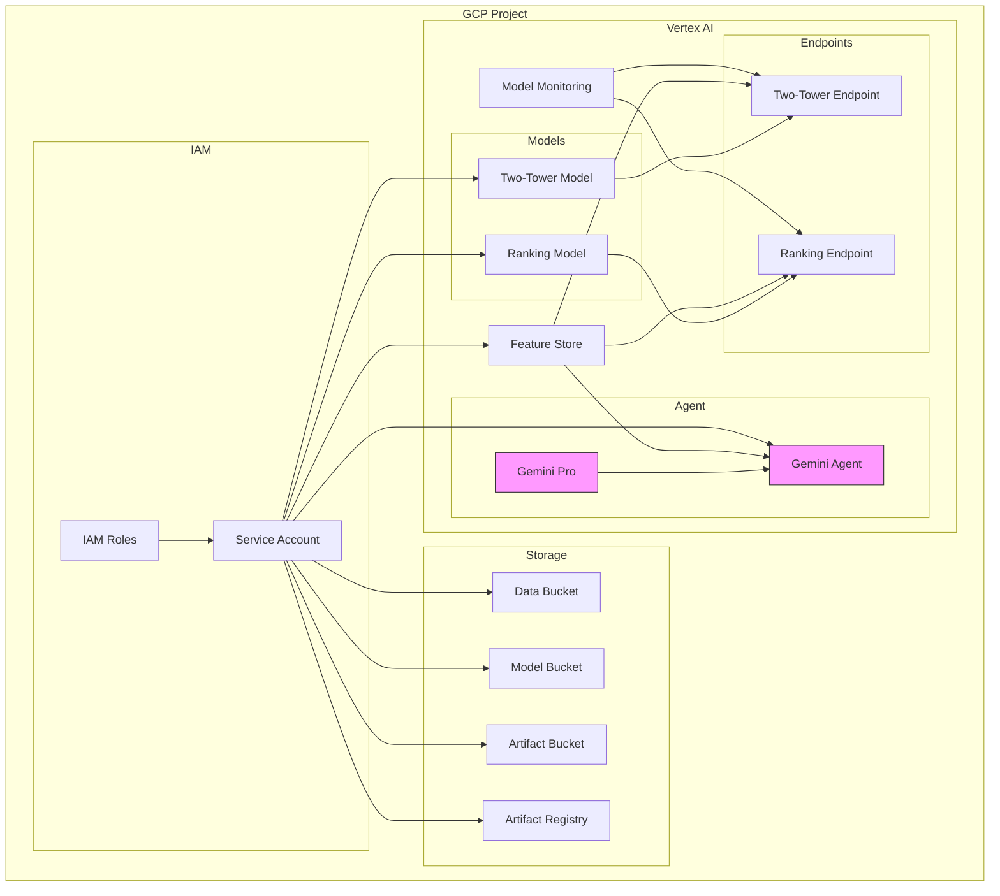

# Infrastructure as Code for Recommender System

This directory contains the Terraform configurations for deploying the recommender system infrastructure on Google Cloud Platform (GCP).

## Prerequisites

- An active GCP project
- Service account with necessary permissions
- Service account key file

## Infrastructure Overview



## Module Structure

```
terraform/
├── main.tf                 # Main configuration file
├── variables.tf            # Input variables
├── outputs.tf             # Output definitions
├── terraform.tfvars.example # Example variable values
└── modules/
    ├── feature-store/     # Vertex AI Feature Store
    ├── vertex-ai/         # Models, Endpoints, and Gemini Agent
    ├── storage/           # GCS and Artifact Registry
    └── iam/               # IAM and Service Accounts
```

[Rest of the README content remains the same...]