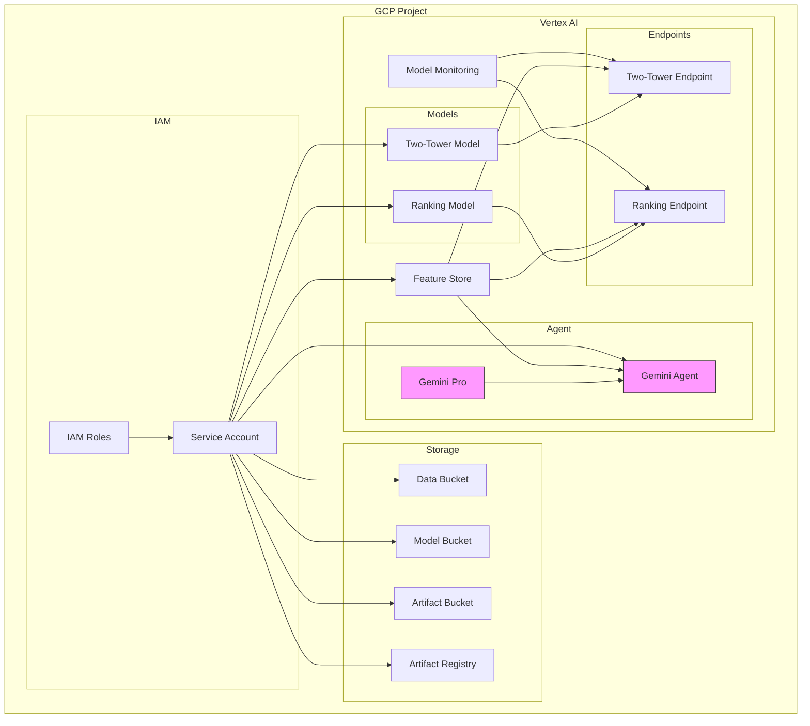
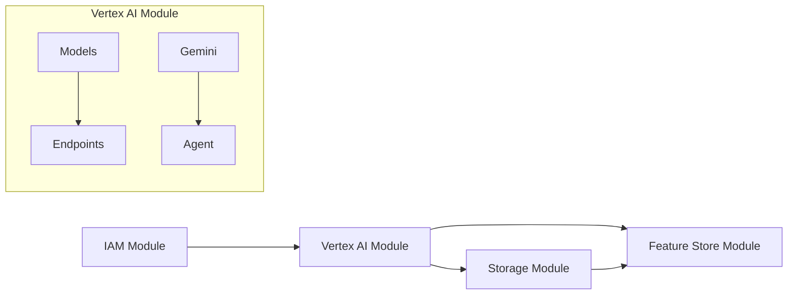

# Infrastructure as Code for Recommender System

This directory contains the Terraform configurations for deploying the recommender system infrastructure on Google Cloud Platform (GCP).

## Infrastructure Overview



## Module Structure

```
terraform/
├── main.tf                 # Main configuration file
├── variables.tf            # Input variables
├── outputs.tf             # Output definitions
├── terraform.tfvars.example # Example variable values
└── modules/
    ├── feature-store/     # Vertex AI Feature Store
    ├── vertex-ai/         # Models, Endpoints, and Gemini Agent
    ├── storage/           # GCS and Artifact Registry
    └── iam/               # IAM and Service Accounts
```

## Modules Description

### Vertex AI Module
Handles ML infrastructure including:

#### Model Registry and Endpoints
- Two-Tower Model for candidate generation
- Ranking Model for candidate scoring
- Model endpoints for online serving

#### Vertex AI Agent (Gemini)
- Gemini Pro-powered agent for LLM ranking
- Configuration:
  ```hcl
  resource "google_vertex_ai_agent" "llm_ranking_agent" {
    name         = var.agent_id
    display_name = "LLM Ranking Agent"
    description  = "Gemini-based agent for LLM ranking"
    
    agent_config {
      agent_generation_config {
        base_model = "gemini-pro"
        use_system_prompts = true
        allow_custom_prompt = true
        model_parameters = {
          temperature     = 0.2
          top_p          = 0.8
          top_k          = 40
          candidate_count = 1
        }
      }
    }
  }
  ```

#### Model Monitoring
- Feature distribution monitoring
- Prediction skew detection
- Custom monitoring intervals

Example usage:
```hcl
module "vertex_ai" {
  source = "./modules/vertex-ai"
  
  project_id         = var.project_id
  region            = var.region
  endpoint_id       = "recsys"
  agent_id          = "llm-ranking-agent"
  enable_monitoring = true
}
```

[Previous sections about Feature Store, Storage, and IAM modules remain the same...]

## Resource Dependencies



## Important Notes

1. **Vertex AI Agent**
   - Uses Gemini Pro as base model
   - Optimized for ranking tasks
   - Supports custom prompts
   - Configurable parameters:
     - Temperature: Controls randomness
     - Top-p: Nucleus sampling
     - Top-k: Token filtering
     - Candidate count: Number of responses

2. **API Dependencies**
   - Vertex AI API
   - Gemini API
   - Compute Engine API
   - Artifact Registry API

3. **Security**
   - IAM roles for Gemini access
   - Agent authentication
   - Custom prompt restrictions

## Variables Reference

Key variables for Vertex AI Agent:

| Variable | Description | Default |
|----------|-------------|---------|
| `agent_id` | Gemini Agent identifier | llm-ranking-agent |
| `use_system_prompts` | Enable system prompts | true |
| `allow_custom_prompt` | Allow custom prompts | true |
| `temperature` | Response randomness | 0.2 |
| `top_p` | Nucleus sampling value | 0.8 |

[Previous sections about common operations remain the same...]

## Troubleshooting

Common issues and solutions:

1. **API Enablement**
   ```bash
   # Enable Gemini API
   gcloud services enable gemini.googleapis.com
   ```

2. **Agent Issues**
   - Check API quotas
   - Verify model availability
   - Monitor agent logs

3. **Permission Issues**
   Required roles:
   - `roles/aiplatform.user`
   - `roles/aiplatform.admin` (for agent creation)
